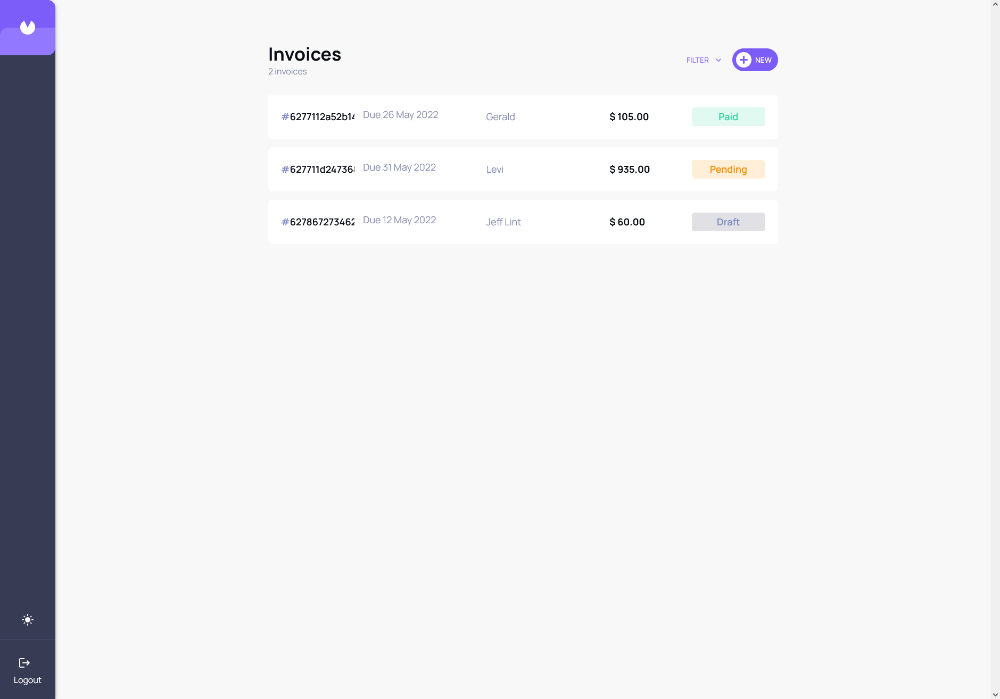
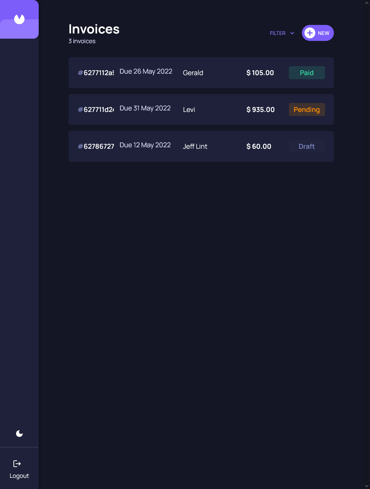
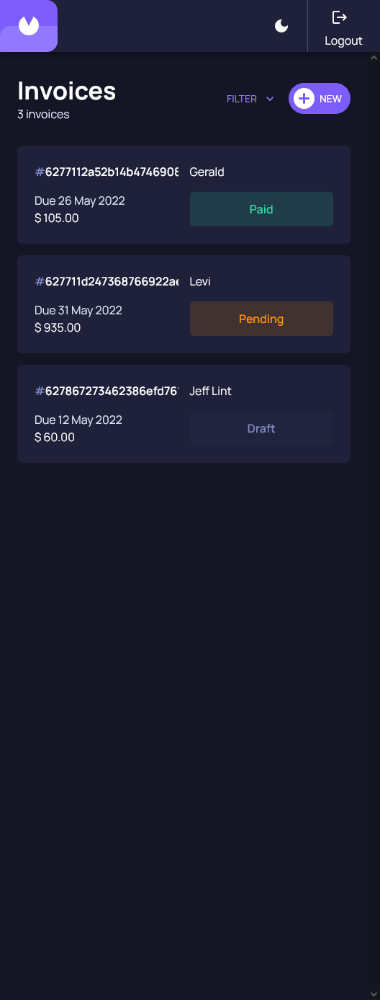
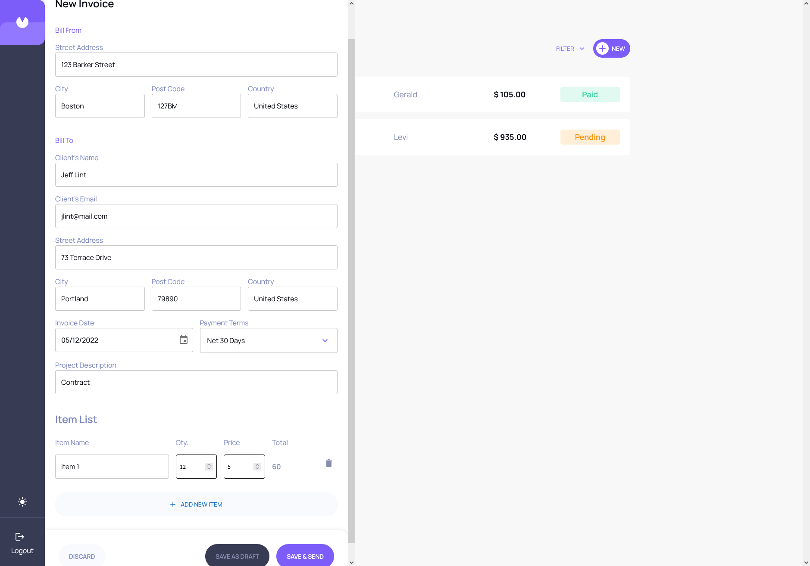
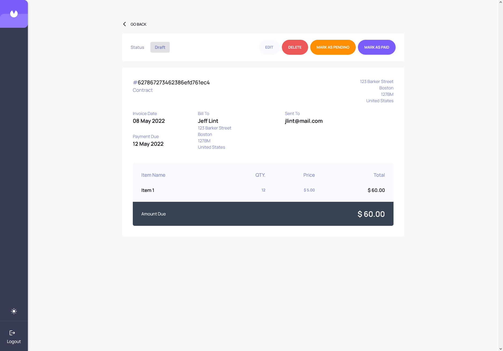
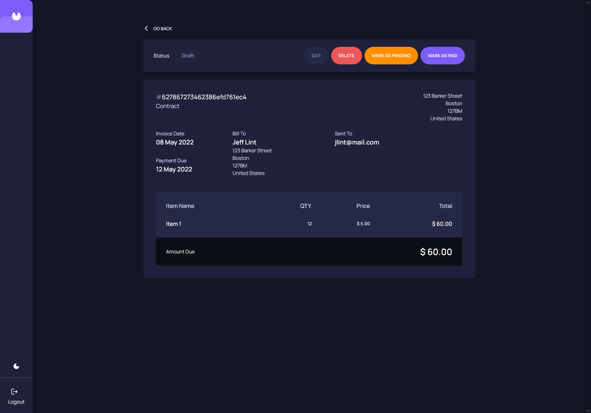
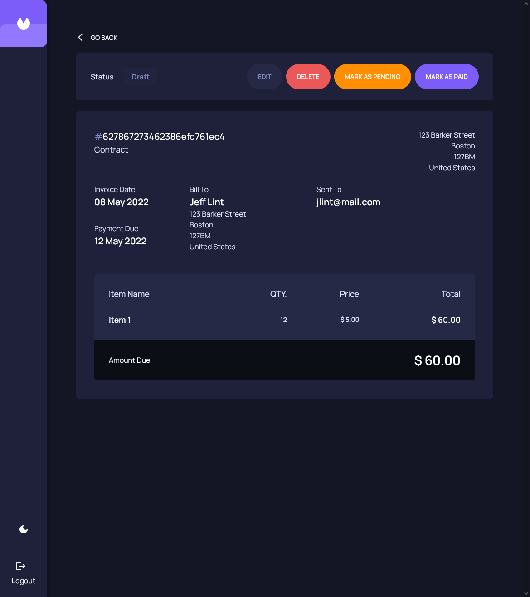
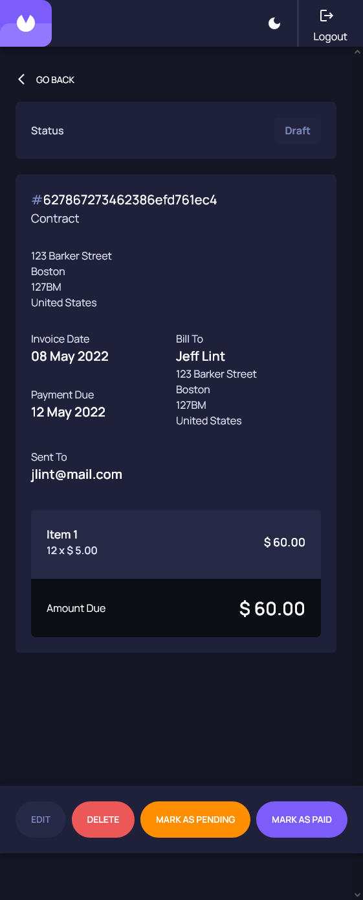

# Frontend Mentor - Invoice app solution

This is a solution to the [Invoice app challenge on Frontend Mentor](https://www.frontendmentor.io/challenges/invoice-app-i7KaLTQjl). Frontend Mentor challenges help you improve your coding skills by building realistic projects. 

## Table of contents

- [Overview](#overview)
  - [The challenge](#the-challenge)
  - [Screenshots](#screenshots)
  - [Links](#links)
- [My process](#my-process)
  - [Built with](#built-with)
  - [What I learned](#what-i-learned)
  - [Continued development](#continued-development)
- [Author](#author)

## Overview

### The challenge

Users should be able to:

- View the optimal layout for the app depending on their device's screen size
- See hover states for all interactive elements on the page
- Create, read, update, and delete invoices
- Receive form validations when trying to create/edit an invoice
- Save draft invoices, and mark pending invoices as paid
- Filter invoices by status (draft/pending/paid)
- Toggle light and dark mode

### Screenshots

- Login Page

- Home Page
  - Desktop
    - Light mode
    
    - Dark mode
    
  - Tablet
  
  - Mobile
  
- Creating an invoice

- Invoice Page
  - Desktop
    - Light mode
    
    - Dark mode
    
  - Tablet
  
  - Mobile
  

### Links

- Live Site URL: [Add live site URL here](https://your-live-site-url.com)

## My process

### Built with

- [MongoDB](https://www.mongodb.com/) - Database
- [React](https://reactjs.org/) - JS library
- [Node.js](https://nodejs.org/en/) - JS runtime
- [Express.js](https://expressjs.com/) - Web framework for Node.js
- [MUI](https://mui.com/) - Material UI styling library/framework for React
- [Mongoose](https://mongoosejs.com/) - Object Data Modeling library for MongoDB
- [Axios](https://axios-http.com/) - HTTP client library for the browser and Node.js
- [React-router-dom](https://reactrouter.com/) - Client-side routing library
- [JsonWebToken](https://github.com/auth0/node-jsonwebtoken#readme) - A library for implementing JSON Web Tokens
- [Bcrypt](https://github.com/kelektiv/node.bcrypt.js#readme) - A library for hashing passwords
- Custom CSS properties

### What I learned

- How to use MUI
- How to store and use JWTs to authenticate users and protect API endpoints
- How to use bcrypt to hash and encrypt passwords

### Continued development

Going forward, I would like to keep using JWTs to become more familiar with them, possibly learning other ways to store them or learn how to implement refresh tokens. I would, also, like to use Material UI more due to how quick it is to create a working, user-friendly UI/UX experience.

## Author
- Website - [Christopher Cox](https://chriscox12.github.io/)
- Frontend Mentor - [@ChrisCox12](https://www.frontendmentor.io/profile/ChrisCox12)